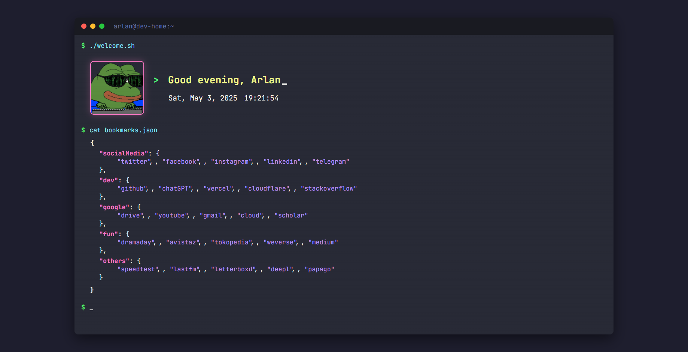

# Edge Start Page

A customizable, developer-themed browser start page that resembles a terminal/command-line interface. This start page features a typing effect greeting, real-time date and time display, and organized bookmarks in a JSON-like format.



## Features

- 🖥️ **Terminal Interface**: Authentic terminal window design with command prompts
- ⌨️ **Typing Effect**: Dynamic greeting with a blinking cursor and typing animation
- 🕒 **Real-time Clock**: Live updating date and time in terminal format
- 📊 **JSON-style Bookmarks**: Links organized in a clean, code-like JSON structure
- 🎨 **Dracula Theme**: Popular dark code editor color scheme
- 📱 **Responsive Design**: Works on all screen sizes
- 🔤 **Developer Fonts**: Uses popular coding fonts (JetBrains Mono, Fira Code)
- ✨ **Visual Effects**: Subtle terminal scan lines and CRT flicker effects

## Installation

### 1. Clone the Repository

```bash
git clone https://github.com/handikatriarlan/edge-startpage.git
```

### 2. Set Up for Microsoft Edge

- Open Microsoft Edge.
- Navigate to `edge://extensions`.
- Enable Developer mode in the top-right corner.
- Click on Load unpacked.
- Select the folder where you cloned the project (`edge-startpage`).

## Customization

### Changing Links

Edit the links in the `index.html` file. Each category follows this format:

```html
<div class="json-category">
  <div class="json-key">"categoryName"</div>
  : {
  <div class="json-links">
    <a href="https://example.com/">"linkName"</a>
  </div>
  },
</div>
```

### Changing Colors The color scheme is defined in CSS variables at the top of

the `style.css` file:

```css
:root {
  --bg-color: #1e1e2e;
  --terminal-bg: #282a36;
  --terminal-header: #191a21;
  --text-color: #f8f8f2;
  --prompt-color: #50fa7b;
  --command-color: #8be9fd;
  --key-color: #ff79c6;
  --value-color: #f1fa8c;
  --link-color: #bd93f9;
  --link-hover: #ff79c6;
  --cursor-color: #f8f8f2;
  --comment-color: #6272a4;
}
```

Modify these values to change the color scheme.

### Changing the Image/GIF

Replace the GIF URL in the `index.html` file:

```html

```

```html

```

### Modifying the Typing Effect

Adjust the typing speed in the `script.js` file:

```javascript
const typingSpeed = 100
```

Lower values make typing faster, higher values make it slower.

## Browser Compatibility

- Edge: Full support
- Chrome: Full support
- Firefox: Full support
- Safari: Full support
- Opera: Full support

## Technologies Used

- HTML5
- CSS3
- Vanilla JavaScript
- Google Fonts (JetBrains Mono, Fira Code)

## Acknowledgments

- Dracula Theme color palette
- JetBrains Mono and Fira Code fonts
- Inspiration from terminal interfaces and code editors
